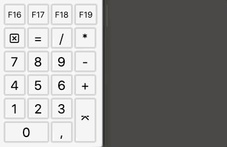
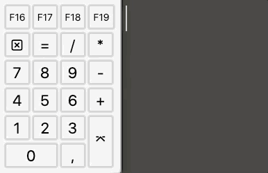
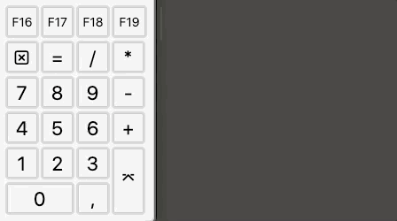

# NumMacroPad

A Hammerspoon spoon to use your numpad as a macro pad for emoji and text snippets. It's meant to 
help with responding quickly in chat during livestreams.

## Demo Gifs

Assigning emoji to numpad keys:



Another layer of text/emoji with a custom modifier key (`0` in this case) and auto-pressing return:



Assigning a list of text/emoji strings to one key, emitting a random one (but never the same twice
in a row:



## Setup

Install Hammerspoon as per the instructions in the _Setup_ section on the 
[Hammerspoon website](http://www.hammerspoon.org/go/).

Then [download the the Spoon](https://downgit.github.io/#/home?url=https://github.com/flxs/nummacropad/tree/main/NumMacroPad.spoon), unzip and double-click to install.

## Configuration

In your `init.lua` (click Hammerspoon's menubar icon, _Open Config_), load the spoon like this:

```lua
hs.loadSpoon("NumMacroPad")
```

You need to configure keys individually. Numpad keys that work are:

```lua
"0", "1", "2", "3", "4", "5", "6", "7", "8", "9", "+", "-", "*", "/", "enter"
```

The `,` and numlock keys are not supported at this point.

It's possible to use one numpad key as a modifier key. If the modifier is held when pressing another
numpad key, a different (configured) text is sent than without the modifier key, similar to an Alt
key.

To use `0` as the modifier key, add:

```lua
spoon.NumMacroPad:key_layer_shift("0")
```

Config for the actual keys looks like this:

```
spoon.NumMacroPad:key_message("+",
	"🙏",
	"thanks! 🙏<enter>"
)
```

This says: Key `+` emits "🙏"" when pressed without the modifier (or if no modifier is defined).
With the modifier key held down, it emits "thanks! 🙏" and the return key is (virtually) pressed,
which would send the message in most chat clients.

You can also specify a list of text snippets (with or without `<enter>`); if such a list is given,
the spoon will pick a random text and emit that (but never the same one twice in a row). This would
look like this:

```lua
spoon.NumMacroPad:key_message("+",
	"🙏",
	{
		"thanks! 🙏<enter>",
		"thank you! 🙏<enter>",
		"thanks! 🙏🙏🙏<enter>",
		"thank you!<enter>",
		"🙏🙏🙏<enter>"
	}
)
```

You'll have to do this for each key. If you do not specify one key, it keeps it's default function,
i.e. if you don't reconfigure `enter`, it'll work as an enter key.

A complete config is shown below. This will emit emoji like the emoji touchbar or the macOS
emoji picker, and three consecutive emoji with an enter keypress if `0` is held down. `+` acts as a
special thank-you key and will send a random thank-you message if pressed while the modifier `0` is
held down.

```lua
hs.loadSpoon("NumMacroPad")

spoon.NumMacroPad:key_layer_shift( "0" )

spoon.NumMacroPad:key_message( "1", 
	"😳",
	"😳😳😳<enter>"
)

spoon.NumMacroPad:key_message( "2",
	"🥳",
	"🥳🥳🥳<enter>"
)

spoon.NumMacroPad:key_message( "3", 
	"😊",
	"😊😊😊<enter>"
)

spoon.NumMacroPad:key_message( "4",
	"😂",
	"😂😂😂<enter>"
)

spoon.NumMacroPad:key_message( "5", 
	"🤗",
	"🤗🤗🤗<enter>"
)

spoon.NumMacroPad:key_message( "6",
	"💜",
	"💜❤️💛<enter>"
)

spoon.NumMacroPad:key_message( "7",
	"🙌",
	"🙌 🙌 🙌<enter>"
)

spoon.NumMacroPad:key_message( "8",
	"👍",
	"👍👍👍<enter>"
)

spoon.NumMacroPad:key_message( "9",
	"🔥",
	"🔥🔥🔥<enter>"
)

spoon.NumMacroPad:key_message( "/",
	"😯",
	"😯<enter>"
)

spoon.NumMacroPad:key_message( "-",
	"😢",
	"😢😢😢<enter>"
)

spoon.NumMacroPad:key_message( "*",
	"🥺",
	"🥺🥺🥺<enter>"
)

spoon.NumMacroPad:key_message( "enter",
	"🦆",
	"🦆🦆🦆<enter>"
)

spoon.NumMacroPad:key_message( "+",
	"🙏",
	{
		"thanks! 🙏<enter>",
		"thank you! 🙏<enter>",
		"thanks! 🙏🙏🙏<enter>",
		"thank you!<enter>",
		"🙏🙏🙏<enter>"
	}
)
```

Once you're done, click Hammerspoon's menubar icon again and select _Reload config_.